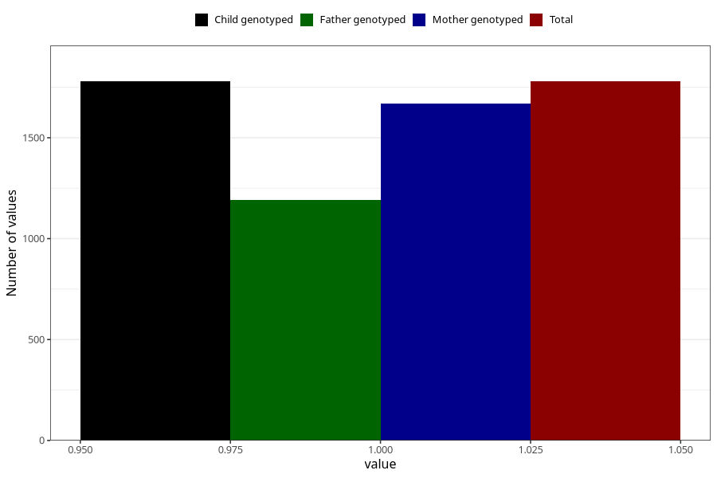

# influenza_13w_15w
Variable mapping to `AA379` in `Skjema1_v12`.
- Number of values:

| Value | Total | Child genotyped | Mother genotyped | Father genotyped |
| ----- | ----- | --------------- | ---------------- | ---------------- |
| Missing | 79226 | 79226 | 74946 | 52413 |
| Non-missing | 1779 | 1779 | 1671 | 1191 |
| 1 | 1779 | 1779 | 1671 | 1191 |

