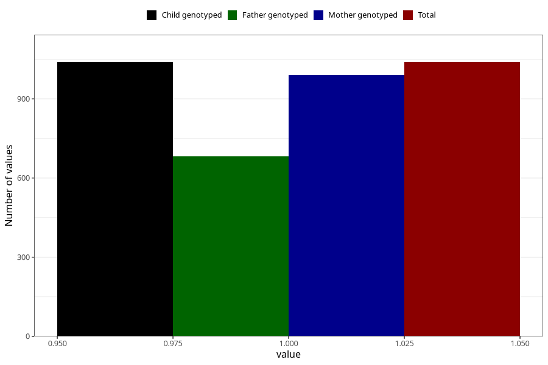

# influenza_5w_8w
Variable mapping to `AA377` in `Skjema1_v12`.
- Number of values:

| Value | Total | Child genotyped | Mother genotyped | Father genotyped |
| ----- | ----- | --------------- | ---------------- | ---------------- |
| Missing | 79966 | 79966 | 75625 | 52922 |
| Non-missing | 1039 | 1039 | 992 | 682 |
| 1 | 1039 | 1039 | 992 | 682 |

