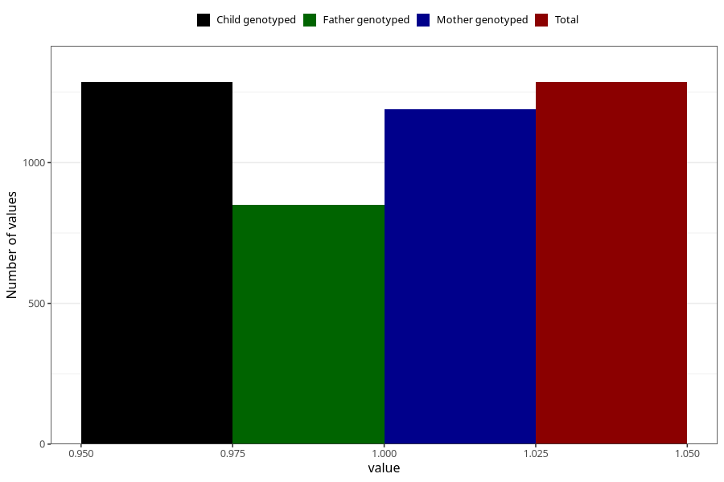

# influenza_9w_12w
Variable mapping to `AA378` in `Skjema1_v12`.
- Number of values:

| Value | Total | Child genotyped | Mother genotyped | Father genotyped |
| ----- | ----- | --------------- | ---------------- | ---------------- |
| Missing | 79719 | 79719 | 75427 | 52755 |
| Non-missing | 1286 | 1286 | 1190 | 849 |
| 1 | 1286 | 1286 | 1190 | 849 |

