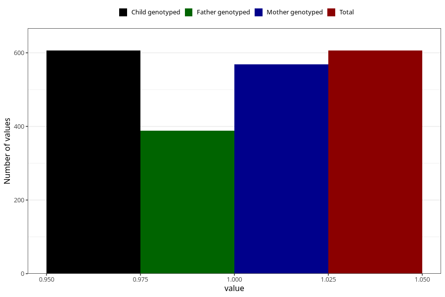

# influenza_before_4w
Variable mapping to `AA376` in `Skjema1_v12`.
- Number of values:

| Value | Total | Child genotyped | Mother genotyped | Father genotyped |
| ----- | ----- | --------------- | ---------------- | ---------------- |
| Missing | 80399 | 80399 | 76048 | 53215 |
| Non-missing | 606 | 606 | 569 | 389 |
| 1 | 606 | 606 | 569 | 389 |

