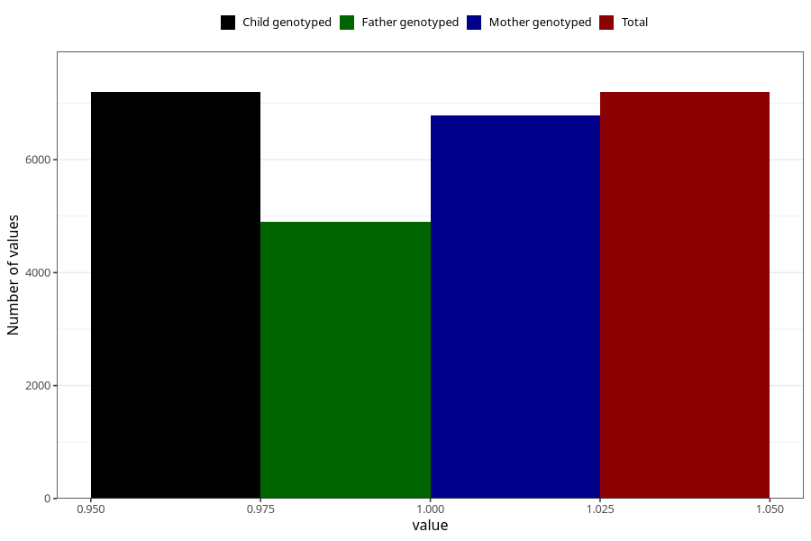

# long_term_nausea_vomiting_13w_16w
Variable mapping to `CC388` in `Skjema3_v12`.
- Number of values:

| Value | Total | Child genotyped | Mother genotyped | Father genotyped |
| ----- | ----- | --------------- | ---------------- | ---------------- |
| Missing | 73810 | 73810 | 69831 | 48698 |
| Non-missing | 7195 | 7195 | 6786 | 4906 |
| 1 | 7195 | 7195 | 6786 | 4906 |

