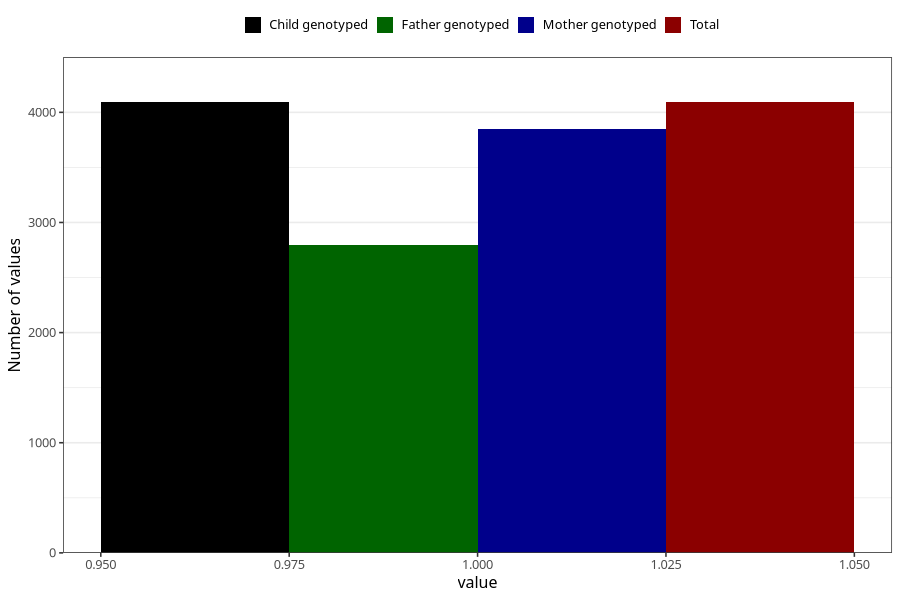

# long_term_nausea_vomiting_17w_20w
Variable mapping to `CC389` in `Skjema3_v12`.
- Number of values:

| Value | Total | Child genotyped | Mother genotyped | Father genotyped |
| ----- | ----- | --------------- | ---------------- | ---------------- |
| Missing | 76913 | 76913 | 72767 | 50811 |
| Non-missing | 4092 | 4092 | 3850 | 2793 |
| 1 | 4092 | 4092 | 3850 | 2793 |

