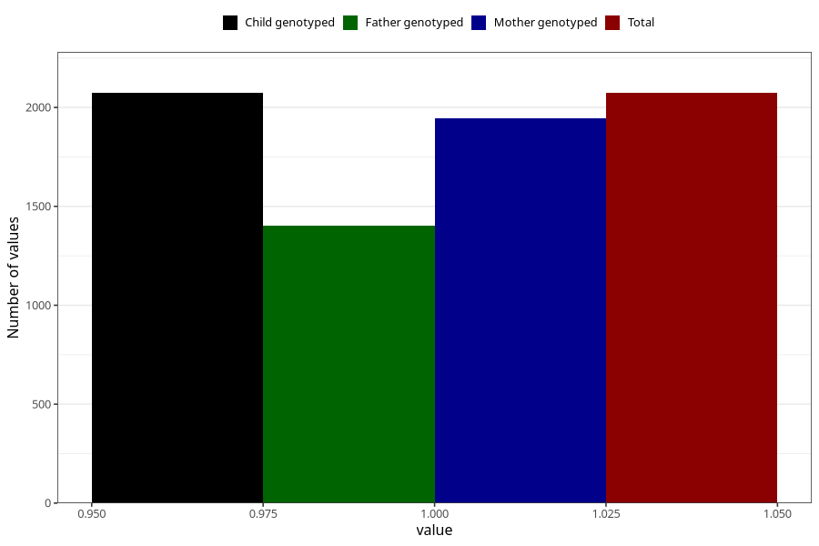

# long_term_nausea_vomiting_21w_24w
Variable mapping to `CC390` in `Skjema3_v12`.
- Number of values:

| Value | Total | Child genotyped | Mother genotyped | Father genotyped |
| ----- | ----- | --------------- | ---------------- | ---------------- |
| Missing | 78932 | 78932 | 74673 | 52203 |
| Non-missing | 2073 | 2073 | 1944 | 1401 |
| 1 | 2073 | 2073 | 1944 | 1401 |

