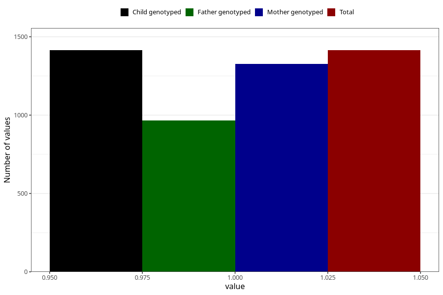

# long_term_nausea_vomiting_25w_28w
Variable mapping to `CC391` in `Skjema3_v12`.
- Number of values:

| Value | Total | Child genotyped | Mother genotyped | Father genotyped |
| ----- | ----- | --------------- | ---------------- | ---------------- |
| Missing | 79591 | 79591 | 75289 | 52639 |
| Non-missing | 1414 | 1414 | 1328 | 965 |
| 1 | 1414 | 1414 | 1328 | 965 |

