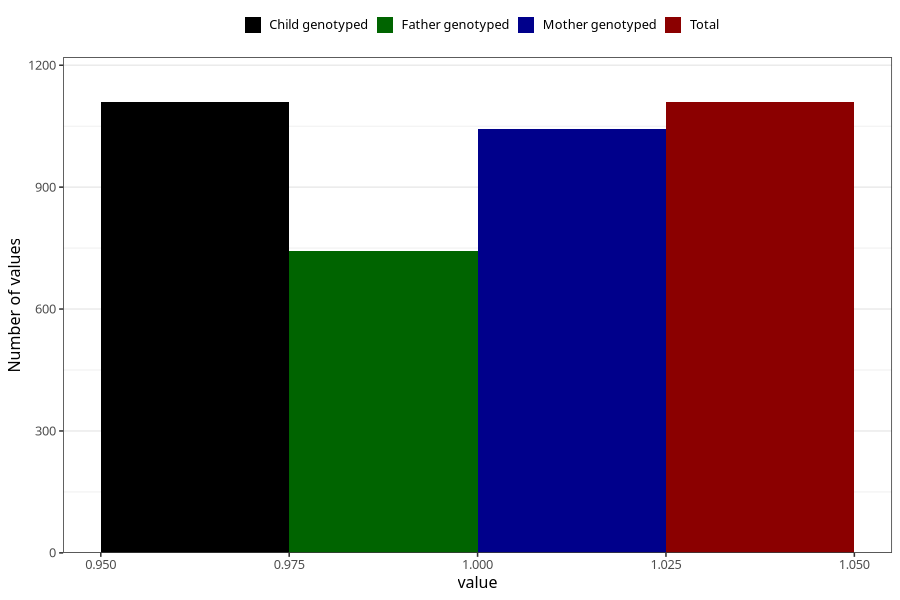

# long_term_nausea_vomiting_after_29w
Variable mapping to `CC392` in `Skjema3_v12`.
- Number of values:

| Value | Total | Child genotyped | Mother genotyped | Father genotyped |
| ----- | ----- | --------------- | ---------------- | ---------------- |
| Missing | 79896 | 79896 | 75573 | 52860 |
| Non-missing | 1109 | 1109 | 1044 | 744 |
| 1 | 1109 | 1109 | 1044 | 744 |

