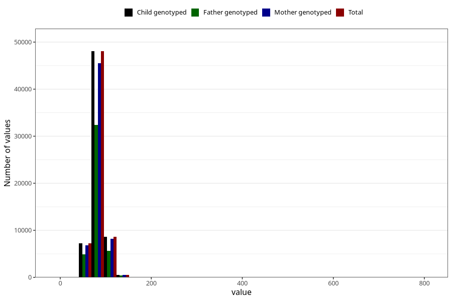

# mother_weight_end_self
Variable mapping to `DD672` in `Skjema4_6mnd_v12`.
- Number of values:

| Value | Total | Child genotyped | Mother genotyped | Father genotyped |
| ----- | ----- | --------------- | ---------------- | ---------------- |
| Missing | 16585 | 16585 | 15567 | 10340 |
| Non-missing | 64420 | 64420 | 61050 | 43264 |
| 25th percentile | 74 | 74 | 74 | 73.8 |
| 50th percentile | 81 | 81 | 81 | 81 |
| 75th percentile | 90 | 90 | 90 | 90 |
| Mean | 82.8651071095933 | 82.8651071095933 | 82.8460622440622 | 82.8174949149408 |
| Standard deviation | 14.0476327242688 | 14.0476327242688 | 14.0654811903426 | 13.9615802422274 |
| N | 64420 | 64420 | 61050 | 43264 |

