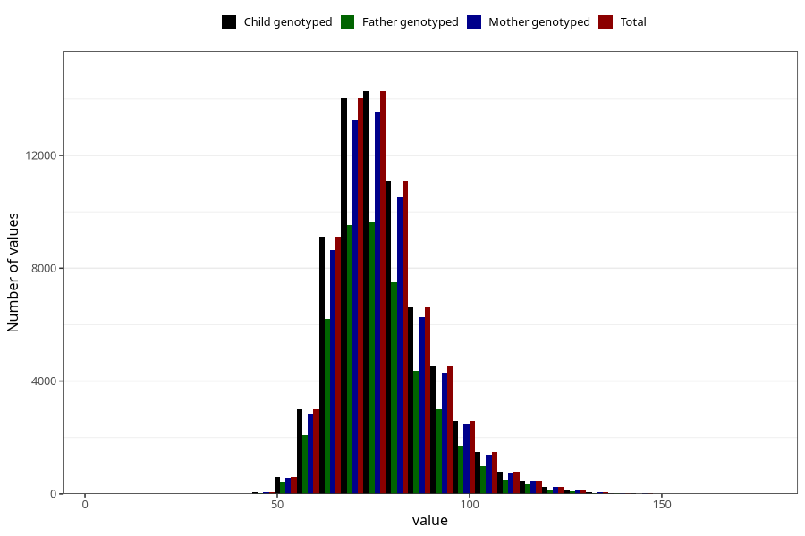

# mother_weight_last_check_30w
Variable mapping to `CC131` in `Skjema3_v12`.
- Number of values:

| Value | Total | Child genotyped | Mother genotyped | Father genotyped |
| ----- | ----- | --------------- | ---------------- | ---------------- |
| Missing | 11860 | 11860 | 11107 | 7010 |
| Non-missing | 69145 | 69145 | 65510 | 46594 |
| 25th percentile | 68.7 | 68.7 | 68.7 | 68.6 |
| 50th percentile | 75.5 | 75.5 | 75.5 | 75.3 |
| 75th percentile | 84 | 84 | 84 | 84 |
| Mean | 77.379914672066 | 77.379914672066 | 77.3746771485269 | 77.2485835086063 |
| Standard deviation | 12.5484198534184 | 12.5484198534184 | 12.5342557998091 | 12.4918072621595 |
| N | 69145 | 69145 | 65510 | 46594 |

