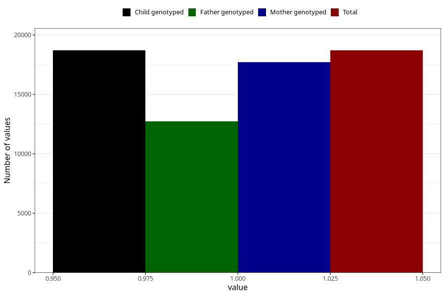

# nausea_13w_15w
Variable mapping to `AA219` in `Skjema1_v12`.
- Number of values:

| Value | Total | Child genotyped | Mother genotyped | Father genotyped |
| ----- | ----- | --------------- | ---------------- | ---------------- |
| Missing | 62306 | 62306 | 58919 | 40867 |
| Non-missing | 18699 | 18699 | 17698 | 12737 |
| 1 | 18699 | 18699 | 17698 | 12737 |

