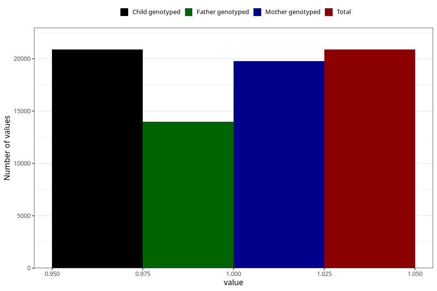

# nausea_13w_16w
Variable mapping to `CC376` in `Skjema3_v12`.
- Number of values:

| Value | Total | Child genotyped | Mother genotyped | Father genotyped |
| ----- | ----- | --------------- | ---------------- | ---------------- |
| Missing | 60133 | 60133 | 56849 | 39642 |
| Non-missing | 20872 | 20872 | 19768 | 13962 |
| 1 | 20872 | 20872 | 19768 | 13962 |

