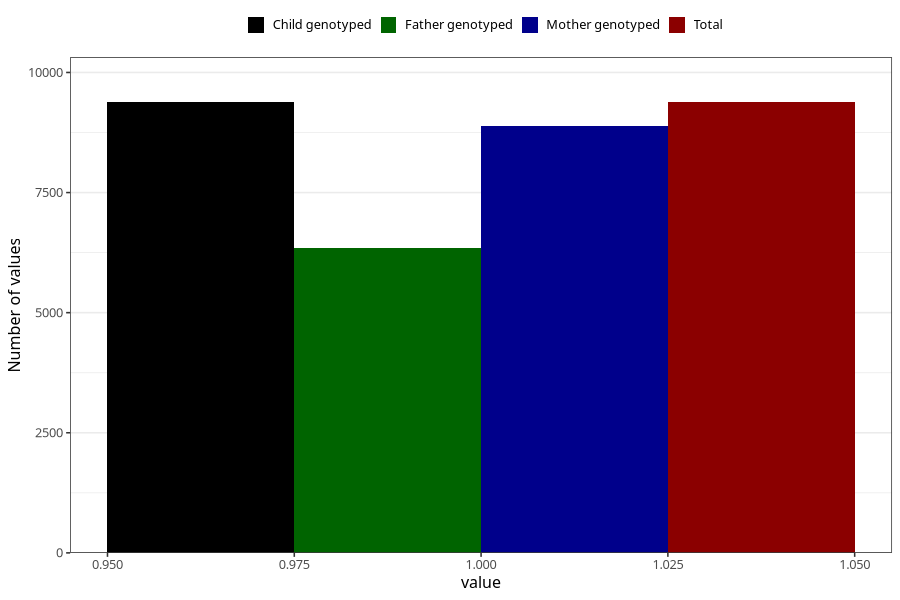

# nausea_17w_20w
Variable mapping to `CC377` in `Skjema3_v12`.
- Number of values:

| Value | Total | Child genotyped | Mother genotyped | Father genotyped |
| ----- | ----- | --------------- | ---------------- | ---------------- |
| Missing | 71624 | 71624 | 67728 | 47252 |
| Non-missing | 9381 | 9381 | 8889 | 6352 |
| 1 | 9381 | 9381 | 8889 | 6352 |

