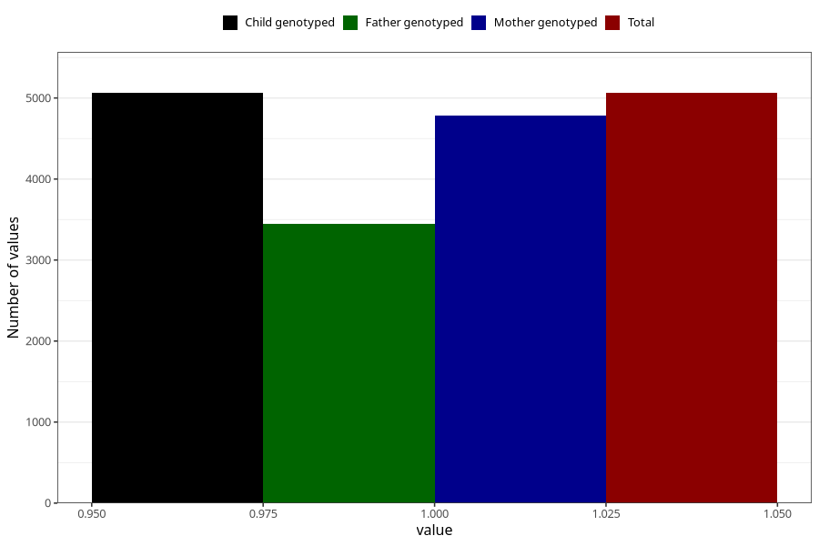

# nausea_21w_24w
Variable mapping to `CC378` in `Skjema3_v12`.
- Number of values:

| Value | Total | Child genotyped | Mother genotyped | Father genotyped |
| ----- | ----- | --------------- | ---------------- | ---------------- |
| Missing | 75943 | 75943 | 71831 | 50154 |
| Non-missing | 5062 | 5062 | 4786 | 3450 |
| 1 | 5062 | 5062 | 4786 | 3450 |

