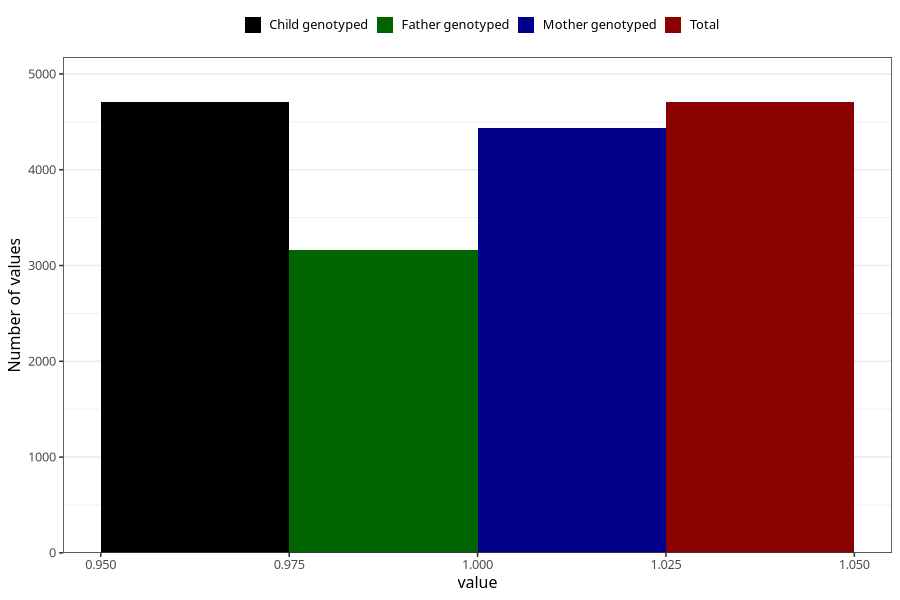

# nausea_25w_28w
Variable mapping to `CC379` in `Skjema3_v12`.
- Number of values:

| Value | Total | Child genotyped | Mother genotyped | Father genotyped |
| ----- | ----- | --------------- | ---------------- | ---------------- |
| Missing | 76300 | 76300 | 72179 | 50442 |
| Non-missing | 4705 | 4705 | 4438 | 3162 |
| 1 | 4705 | 4705 | 4438 | 3162 |

