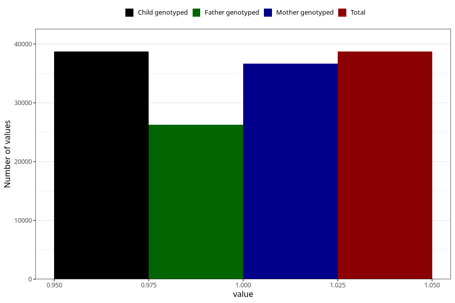

# nausea_9w_12w
Variable mapping to `AA218` in `Skjema1_v12`.
- Number of values:

| Value | Total | Child genotyped | Mother genotyped | Father genotyped |
| ----- | ----- | --------------- | ---------------- | ---------------- |
| Missing | 42297 | 42297 | 39939 | 27306 |
| Non-missing | 38708 | 38708 | 36678 | 26298 |
| 1 | 38708 | 38708 | 36678 | 26298 |

