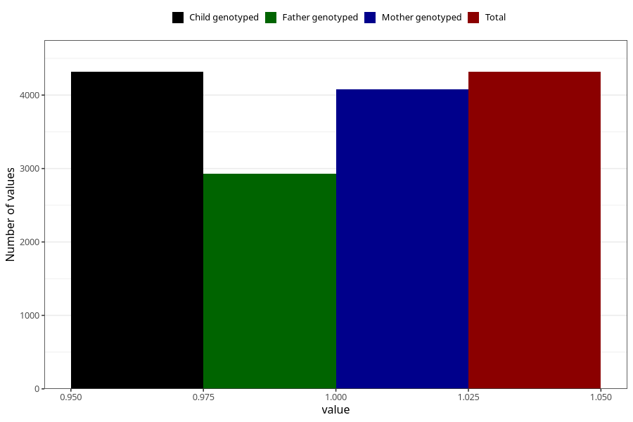

# nausea_after_29w
Variable mapping to `CC380` in `Skjema3_v12`.
- Number of values:

| Value | Total | Child genotyped | Mother genotyped | Father genotyped |
| ----- | ----- | --------------- | ---------------- | ---------------- |
| Missing | 76689 | 76689 | 72543 | 50679 |
| Non-missing | 4316 | 4316 | 4074 | 2925 |
| 1 | 4316 | 4316 | 4074 | 2925 |

