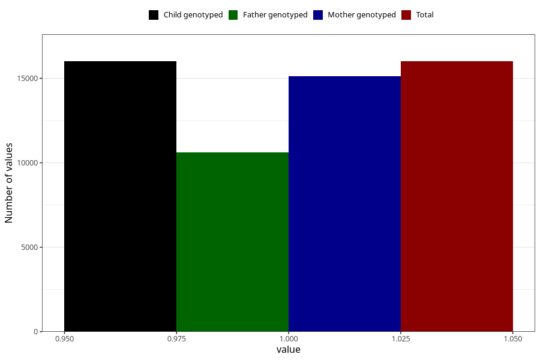

# nausea_before_4w
Variable mapping to `AA216` in `Skjema1_v12`.
- Number of values:

| Value | Total | Child genotyped | Mother genotyped | Father genotyped |
| ----- | ----- | --------------- | ---------------- | ---------------- |
| Missing | 64996 | 64996 | 61488 | 42990 |
| Non-missing | 16009 | 16009 | 15129 | 10614 |
| 1 | 16009 | 16009 | 15129 | 10614 |

