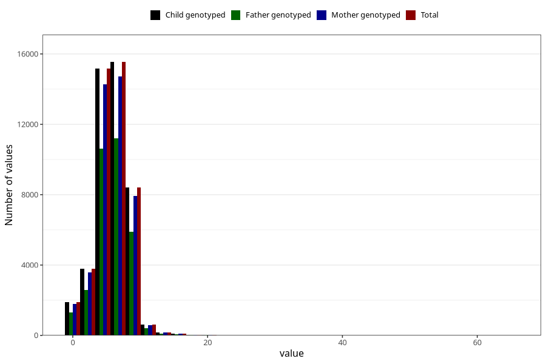

# nausea_week_most_bothered_from_q2
Variable mapping to `BB853` in `Skjema2CDW_v12`.
- Number of values:

| Value | Total | Child genotyped | Mother genotyped | Father genotyped |
| ----- | ----- | --------------- | ---------------- | ---------------- |
| Missing | 35205 | 35205 | 33390 | 21383 |
| Non-missing | 45800 | 45800 | 43227 | 32221 |
| 25th percentile | 4 | 4 | 4 | 4 |
| 50th percentile | 6 | 6 | 6 | 6 |
| 75th percentile | 7 | 7 | 7 | 7 |
| Mean | 5.7310480349345 | 5.7310480349345 | 5.72773960718995 | 5.74603519443841 |
| Standard deviation | 2.38954582492636 | 2.38954582492636 | 2.387121166391 | 2.36086974628214 |
| N | 45800 | 45800 | 43227 | 32221 |

