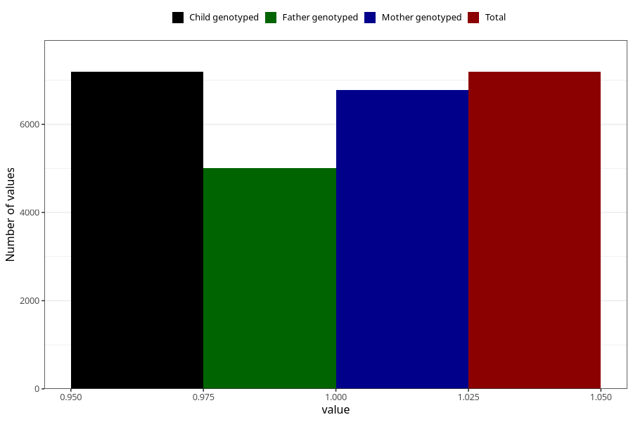

# nausea_week_most_bothered_still_q2
Variable mapping to `BB855` in `Skjema2CDW_v12`.
- Number of values:

| Value | Total | Child genotyped | Mother genotyped | Father genotyped |
| ----- | ----- | --------------- | ---------------- | ---------------- |
| Missing | 73816 | 73816 | 69839 | 48603 |
| Non-missing | 7189 | 7189 | 6778 | 5001 |
| 1 | 7189 | 7189 | 6778 | 5001 |

