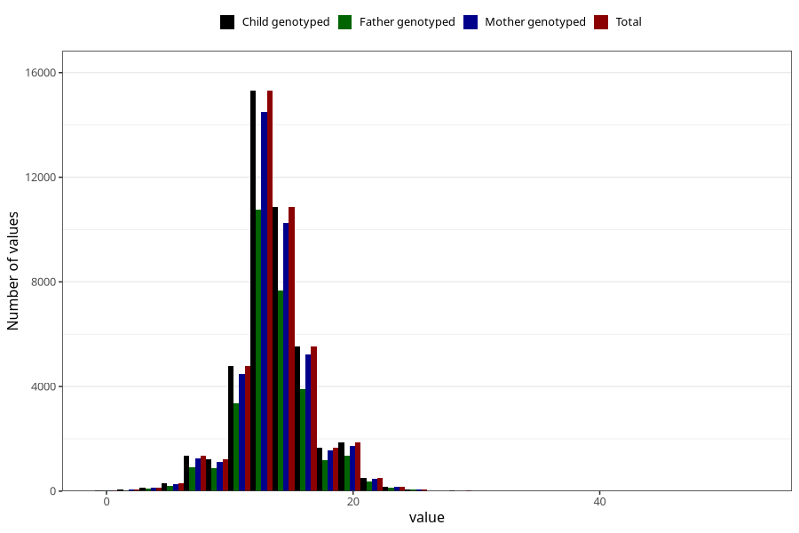

# nausea_week_most_bothered_to_q2
Variable mapping to `BB854` in `Skjema2CDW_v12`.
- Number of values:

| Value | Total | Child genotyped | Mother genotyped | Father genotyped |
| ----- | ----- | --------------- | ---------------- | ---------------- |
| Missing | 37101 | 37101 | 35176 | 22706 |
| Non-missing | 43904 | 43904 | 41441 | 30898 |
| 25th percentile | 12 | 12 | 12 | 12 |
| 50th percentile | 13 | 13 | 13 | 13 |
| 75th percentile | 15 | 15 | 15 | 15 |
| Mean | 13.5309766763848 | 13.5309766763848 | 13.5283173668589 | 13.5561201372257 |
| Standard deviation | 3.10834312055607 | 3.10834312055607 | 3.10387656005326 | 3.08771335676936 |
| N | 43904 | 43904 | 41441 | 30898 |

