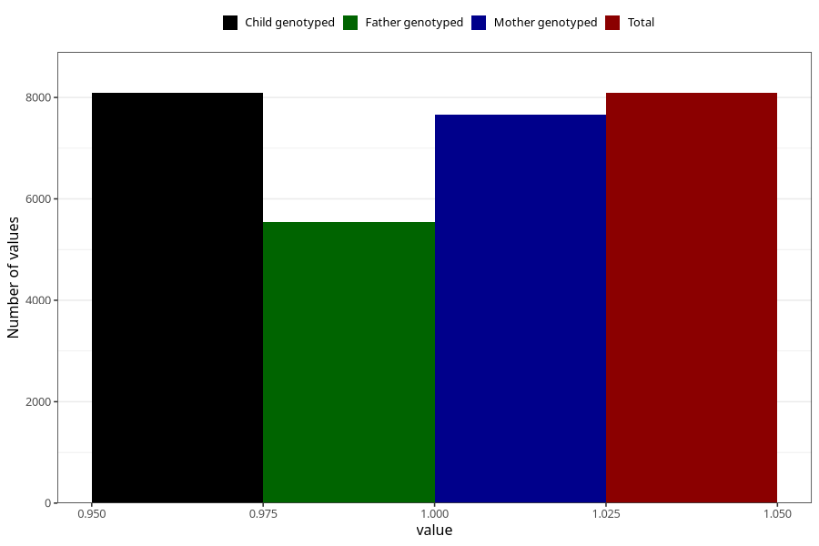

# neck_shoulder_pain_13w_15w
Variable mapping to `AA209` in `Skjema1_v12`.
- Number of values:

| Value | Total | Child genotyped | Mother genotyped | Father genotyped |
| ----- | ----- | --------------- | ---------------- | ---------------- |
| Missing | 72917 | 72917 | 68965 | 48057 |
| Non-missing | 8088 | 8088 | 7652 | 5547 |
| 1 | 8088 | 8088 | 7652 | 5547 |

