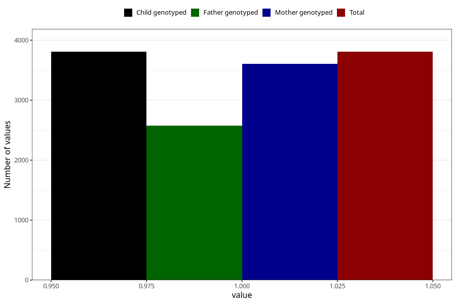

# neck_shoulder_pain_5w_8w
Variable mapping to `AA207` in `Skjema1_v12`.
- Number of values:

| Value | Total | Child genotyped | Mother genotyped | Father genotyped |
| ----- | ----- | --------------- | ---------------- | ---------------- |
| Missing | 77198 | 77198 | 73010 | 51030 |
| Non-missing | 3807 | 3807 | 3607 | 2574 |
| 1 | 3807 | 3807 | 3607 | 2574 |

