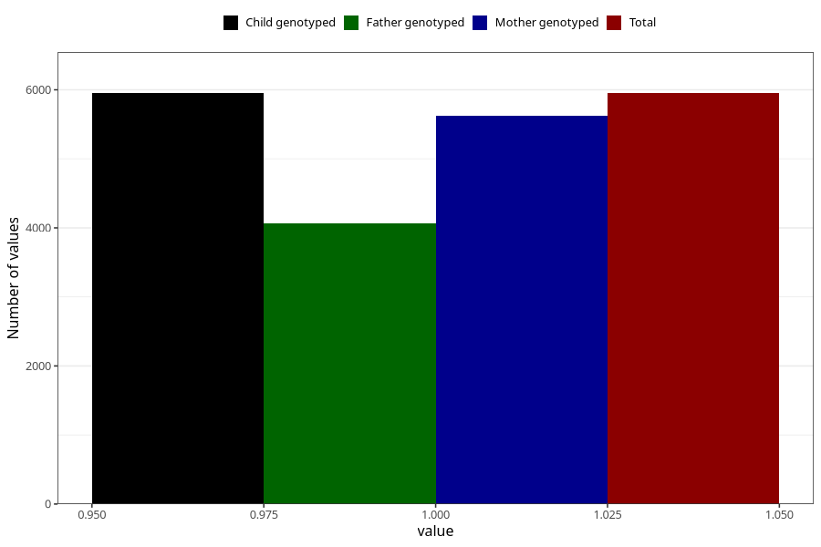

# neck_shoulder_pain_9w_12w
Variable mapping to `AA208` in `Skjema1_v12`.
- Number of values:

| Value | Total | Child genotyped | Mother genotyped | Father genotyped |
| ----- | ----- | --------------- | ---------------- | ---------------- |
| Missing | 75054 | 75054 | 70995 | 49537 |
| Non-missing | 5951 | 5951 | 5622 | 4067 |
| 1 | 5951 | 5951 | 5622 | 4067 |

