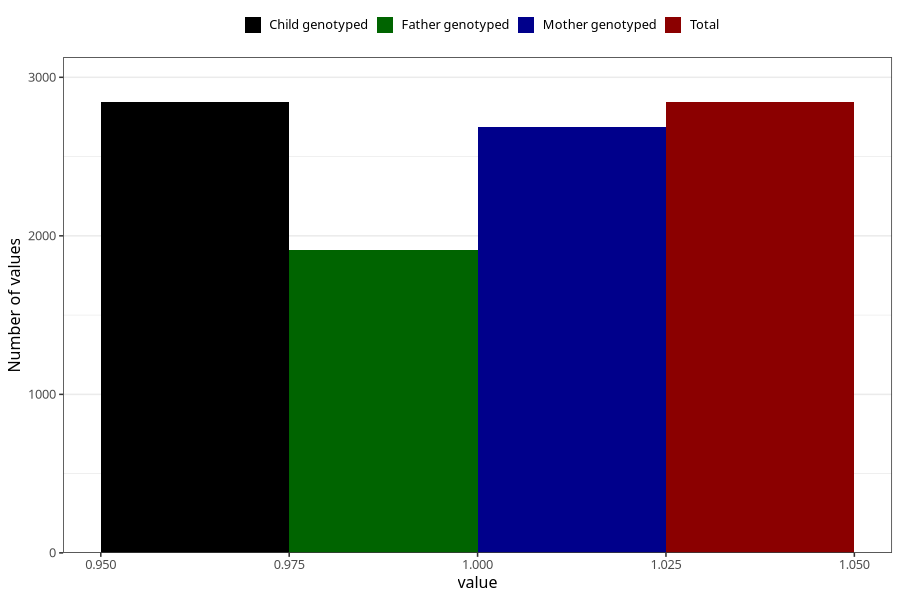

# neck_shoulder_pain_before_4w
Variable mapping to `AA206` in `Skjema1_v12`.
- Number of values:

| Value | Total | Child genotyped | Mother genotyped | Father genotyped |
| ----- | ----- | --------------- | ---------------- | ---------------- |
| Missing | 78162 | 78162 | 73930 | 51695 |
| Non-missing | 2843 | 2843 | 2687 | 1909 |
| 1 | 2843 | 2843 | 2687 | 1909 |

