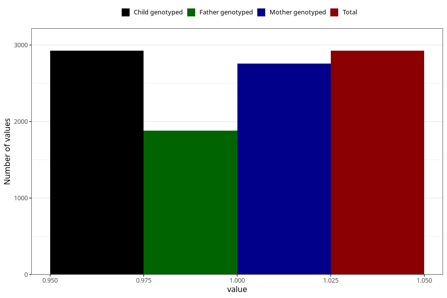

# oedema_13w_15w
Variable mapping to `AA319` in `Skjema1_v12`.
- Number of values:

| Value | Total | Child genotyped | Mother genotyped | Father genotyped |
| ----- | ----- | --------------- | ---------------- | ---------------- |
| Missing | 78080 | 78080 | 73857 | 51724 |
| Non-missing | 2925 | 2925 | 2760 | 1880 |
| 1 | 2925 | 2925 | 2760 | 1880 |

