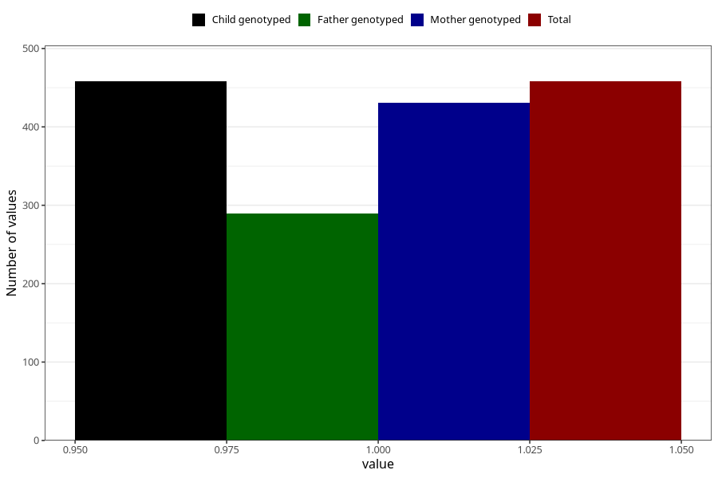

# oedema_5w_8w
Variable mapping to `AA317` in `Skjema1_v12`.
- Number of values:

| Value | Total | Child genotyped | Mother genotyped | Father genotyped |
| ----- | ----- | --------------- | ---------------- | ---------------- |
| Missing | 80547 | 80547 | 76186 | 53314 |
| Non-missing | 458 | 458 | 431 | 290 |
| 1 | 458 | 458 | 431 | 290 |

