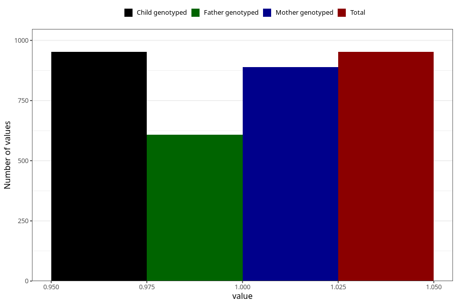

# oedema_9w_12w
Variable mapping to `AA318` in `Skjema1_v12`.
- Number of values:

| Value | Total | Child genotyped | Mother genotyped | Father genotyped |
| ----- | ----- | --------------- | ---------------- | ---------------- |
| Missing | 80053 | 80053 | 75728 | 52995 |
| Non-missing | 952 | 952 | 889 | 609 |
| 1 | 952 | 952 | 889 | 609 |

