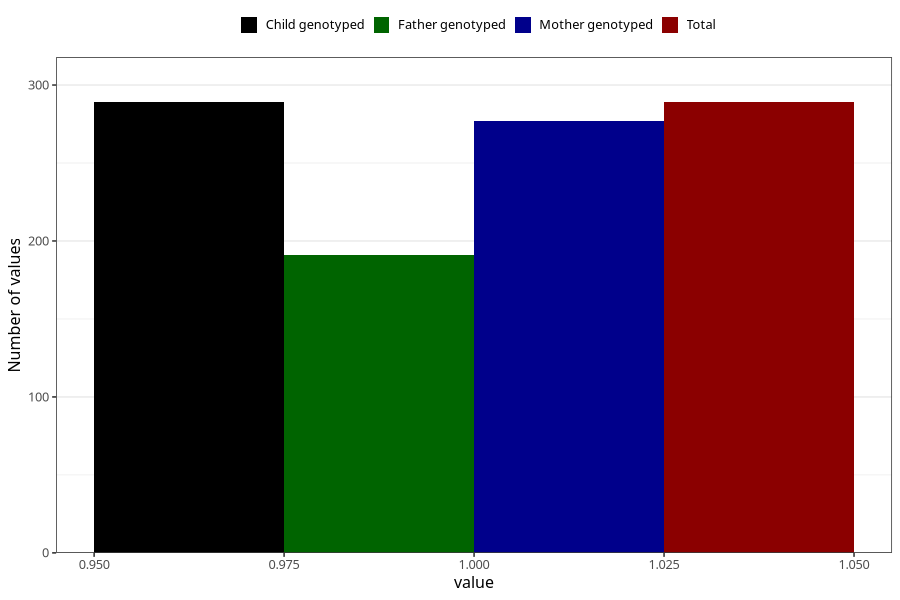

# oedema_before_4w
Variable mapping to `AA316` in `Skjema1_v12`.
- Number of values:

| Value | Total | Child genotyped | Mother genotyped | Father genotyped |
| ----- | ----- | --------------- | ---------------- | ---------------- |
| Missing | 80716 | 80716 | 76340 | 53413 |
| Non-missing | 289 | 289 | 277 | 191 |
| 1 | 289 | 289 | 277 | 191 |

