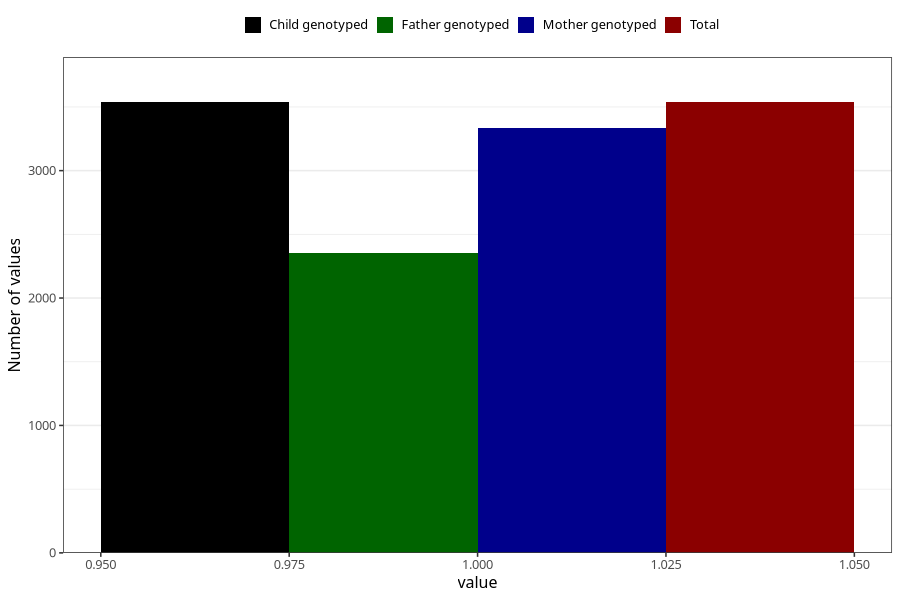

# other_muscle_joint_pain_17w_20w
Variable mapping to `CC365` in `Skjema3_v12`.
- Number of values:

| Value | Total | Child genotyped | Mother genotyped | Father genotyped |
| ----- | ----- | --------------- | ---------------- | ---------------- |
| Missing | 77468 | 77468 | 73286 | 51250 |
| Non-missing | 3537 | 3537 | 3331 | 2354 |
| 1 | 3537 | 3537 | 3331 | 2354 |

