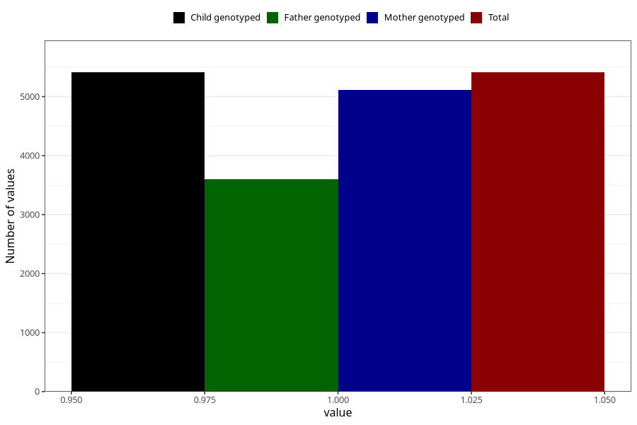

# other_muscle_joint_pain_21w_24w
Variable mapping to `CC366` in `Skjema3_v12`.
- Number of values:

| Value | Total | Child genotyped | Mother genotyped | Father genotyped |
| ----- | ----- | --------------- | ---------------- | ---------------- |
| Missing | 75594 | 75594 | 71509 | 49999 |
| Non-missing | 5411 | 5411 | 5108 | 3605 |
| 1 | 5411 | 5411 | 5108 | 3605 |

