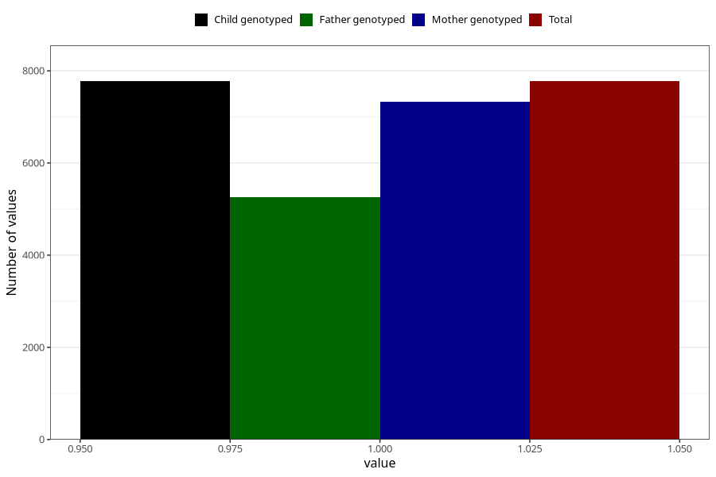

# other_muscle_joint_pain_25w_28w
Variable mapping to `CC367` in `Skjema3_v12`.
- Number of values:

| Value | Total | Child genotyped | Mother genotyped | Father genotyped |
| ----- | ----- | --------------- | ---------------- | ---------------- |
| Missing | 73231 | 73231 | 69286 | 48350 |
| Non-missing | 7774 | 7774 | 7331 | 5254 |
| 1 | 7774 | 7774 | 7331 | 5254 |

