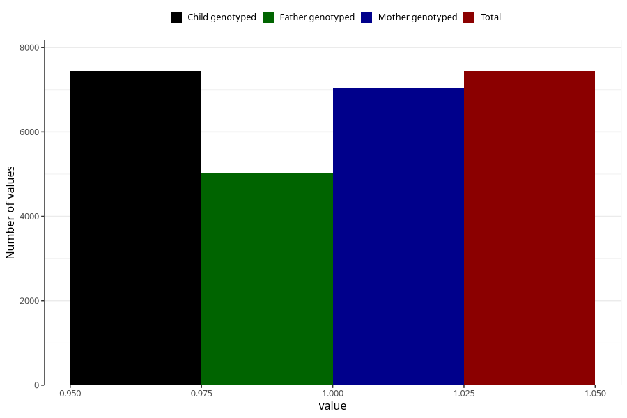

# other_muscle_joint_pain_after_29w
Variable mapping to `CC368` in `Skjema3_v12`.
- Number of values:

| Value | Total | Child genotyped | Mother genotyped | Father genotyped |
| ----- | ----- | --------------- | ---------------- | ---------------- |
| Missing | 73566 | 73566 | 69590 | 48588 |
| Non-missing | 7439 | 7439 | 7027 | 5016 |
| 1 | 7439 | 7439 | 7027 | 5016 |

