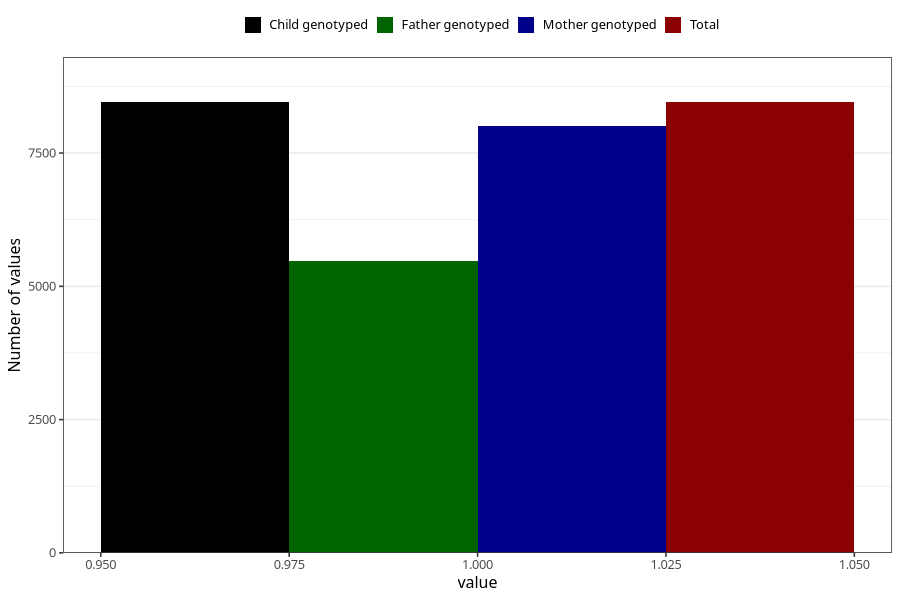

# pelvic_girdle_pain_13w_15w
Variable mapping to `AA179` in `Skjema1_v12`.
- Number of values:

| Value | Total | Child genotyped | Mother genotyped | Father genotyped |
| ----- | ----- | --------------- | ---------------- | ---------------- |
| Missing | 72551 | 72551 | 68617 | 48132 |
| Non-missing | 8454 | 8454 | 8000 | 5472 |
| 1 | 8454 | 8454 | 8000 | 5472 |

