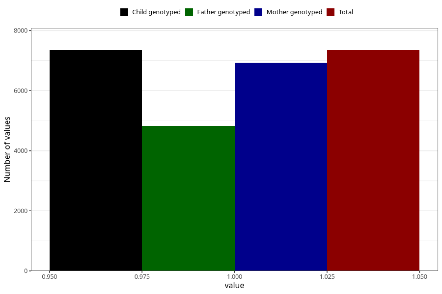

# pelvic_girdle_pain_13w_16w
Variable mapping to `CC340` in `Skjema3_v12`.
- Number of values:

| Value | Total | Child genotyped | Mother genotyped | Father genotyped |
| ----- | ----- | --------------- | ---------------- | ---------------- |
| Missing | 73655 | 73655 | 69691 | 48776 |
| Non-missing | 7350 | 7350 | 6926 | 4828 |
| 1 | 7350 | 7350 | 6926 | 4828 |

