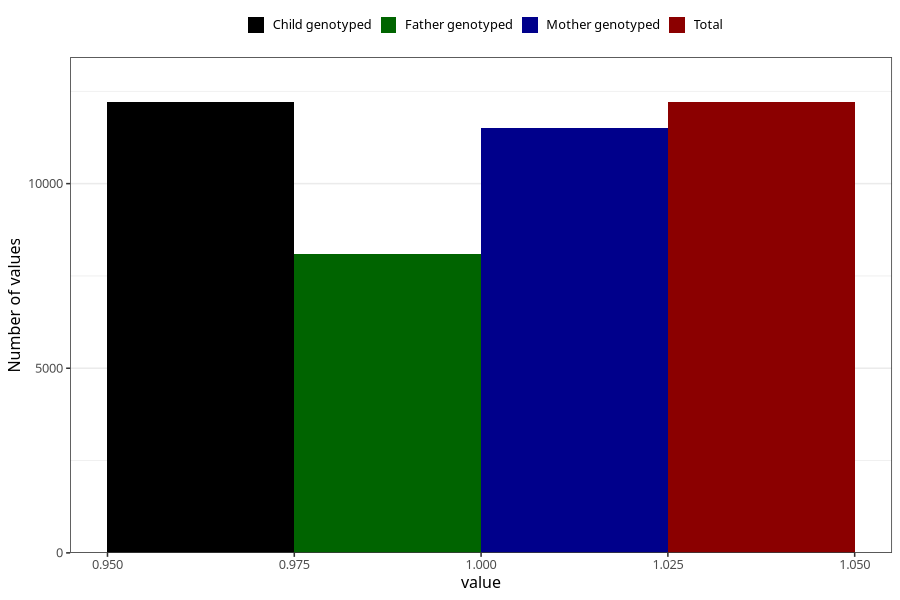

# pelvic_girdle_pain_17w_20w
Variable mapping to `CC341` in `Skjema3_v12`.
- Number of values:

| Value | Total | Child genotyped | Mother genotyped | Father genotyped |
| ----- | ----- | --------------- | ---------------- | ---------------- |
| Missing | 68800 | 68800 | 65108 | 45497 |
| Non-missing | 12205 | 12205 | 11509 | 8107 |
| 1 | 12205 | 12205 | 11509 | 8107 |

