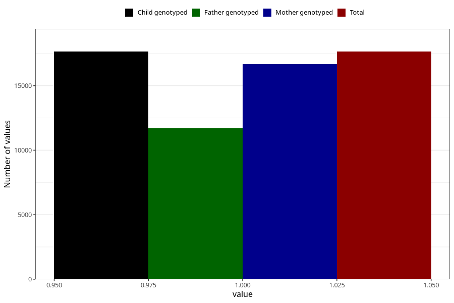

# pelvic_girdle_pain_21w_24w
Variable mapping to `CC342` in `Skjema3_v12`.
- Number of values:

| Value | Total | Child genotyped | Mother genotyped | Father genotyped |
| ----- | ----- | --------------- | ---------------- | ---------------- |
| Missing | 63362 | 63362 | 59952 | 41906 |
| Non-missing | 17643 | 17643 | 16665 | 11698 |
| 1 | 17643 | 17643 | 16665 | 11698 |

