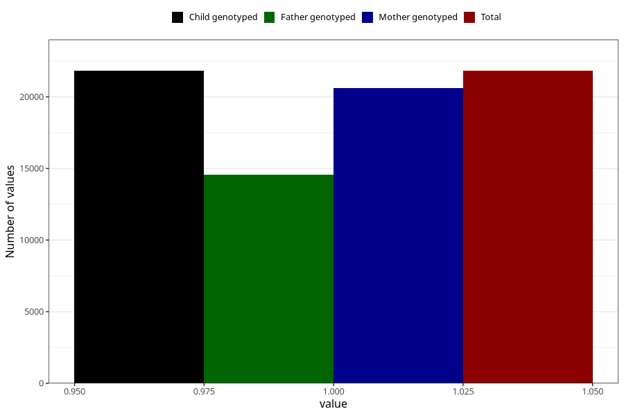

# pelvic_girdle_pain_25w_28w
Variable mapping to `CC343` in `Skjema3_v12`.
- Number of values:

| Value | Total | Child genotyped | Mother genotyped | Father genotyped |
| ----- | ----- | --------------- | ---------------- | ---------------- |
| Missing | 59191 | 59191 | 56009 | 39034 |
| Non-missing | 21814 | 21814 | 20608 | 14570 |
| 1 | 21814 | 21814 | 20608 | 14570 |

