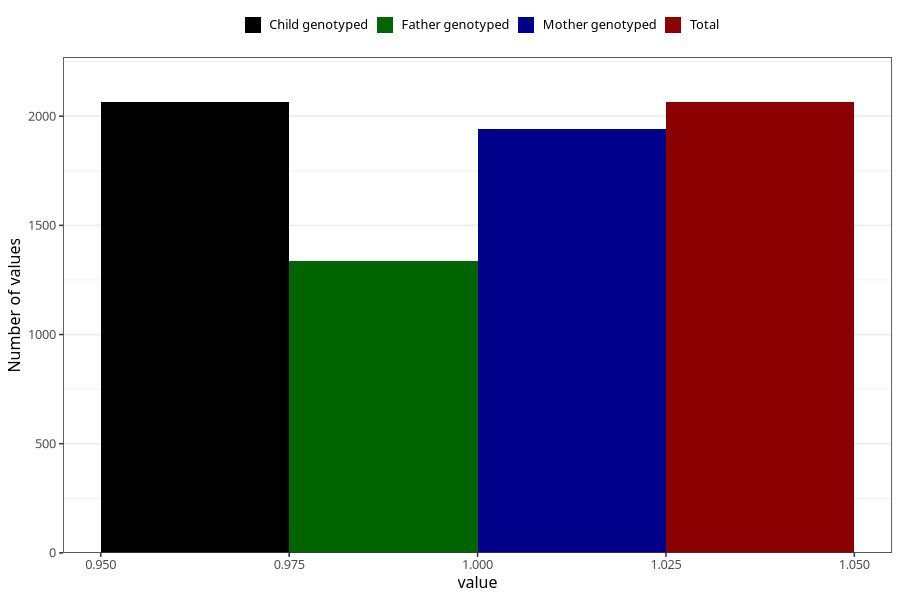

# pelvic_girdle_pain_5w_8w
Variable mapping to `AA177` in `Skjema1_v12`.
- Number of values:

| Value | Total | Child genotyped | Mother genotyped | Father genotyped |
| ----- | ----- | --------------- | ---------------- | ---------------- |
| Missing | 78941 | 78941 | 74675 | 52267 |
| Non-missing | 2064 | 2064 | 1942 | 1337 |
| 1 | 2064 | 2064 | 1942 | 1337 |

