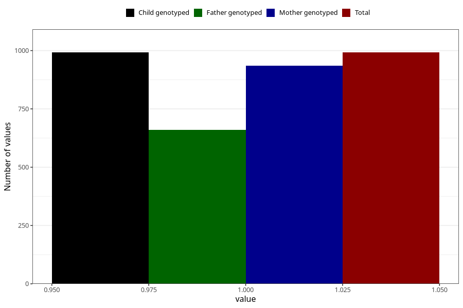

# pelvic_girdle_pain_before_4w
Variable mapping to `AA176` in `Skjema1_v12`.
- Number of values:

| Value | Total | Child genotyped | Mother genotyped | Father genotyped |
| ----- | ----- | --------------- | ---------------- | ---------------- |
| Missing | 80013 | 80013 | 75681 | 52945 |
| Non-missing | 992 | 992 | 936 | 659 |
| 1 | 992 | 992 | 936 | 659 |

