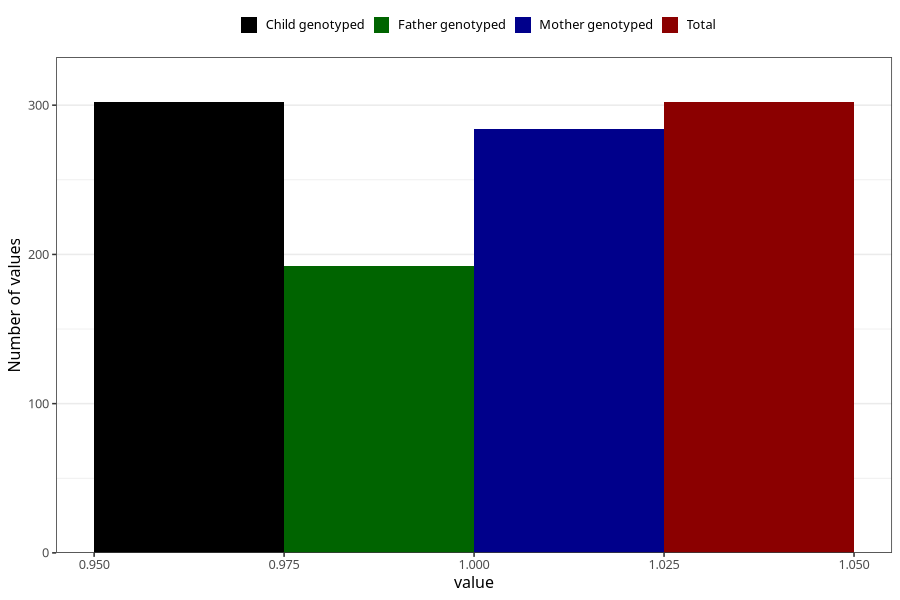

# pneumonia_bronchitis_9w_12w
Variable mapping to `AA388` in `Skjema1_v12`.
- Number of values:

| Value | Total | Child genotyped | Mother genotyped | Father genotyped |
| ----- | ----- | --------------- | ---------------- | ---------------- |
| Missing | 80703 | 80703 | 76333 | 53412 |
| Non-missing | 302 | 302 | 284 | 192 |
| 1 | 302 | 302 | 284 | 192 |

