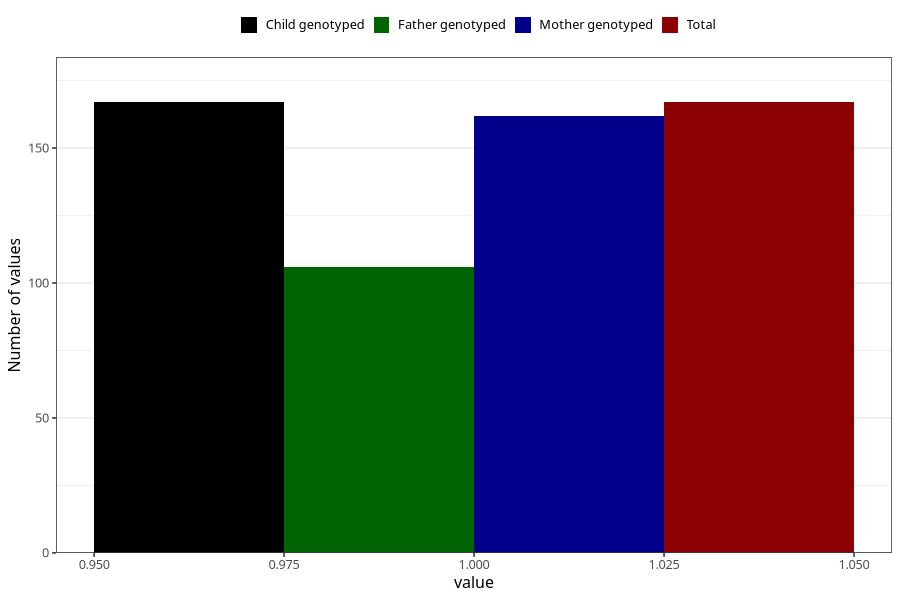

# pneumonia_bronchitis_before_4w
Variable mapping to `AA386` in `Skjema1_v12`.
- Number of values:

| Value | Total | Child genotyped | Mother genotyped | Father genotyped |
| ----- | ----- | --------------- | ---------------- | ---------------- |
| Missing | 80838 | 80838 | 76455 | 53498 |
| Non-missing | 167 | 167 | 162 | 106 |
| 1 | 167 | 167 | 162 | 106 |

