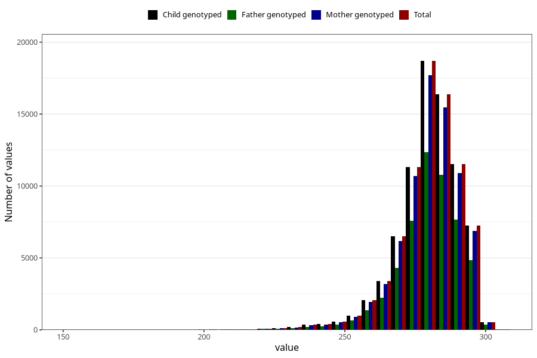

# pregnancy_duration
Variable mapping to `SVLEN_DG` in `MFR_541_v12`.
Variable mapping to `SVLEN_DG` in `MFR_541_v12`.
- Number of values:

| Value | Total | Child genotyped | Mother genotyped | Father genotyped |
| ----- | ----- | --------------- | ---------------- | ---------------- |
| Missing | 392 | 392 | 376 | 254 |
| Non-missing | 80613 | 80613 | 76241 | 53350 |
| 25th percentile | 274 | 274 | 274 | 274 |
| 50th percentile | 281 | 281 | 281 | 281 |
| 75th percentile | 287 | 287 | 287 | 287 |
| Mean | 279.566062545743 | 279.566062545743 | 279.577904277226 | 279.609671977507 |
| Standard deviation | 11.7102772759965 | 11.7102772759965 | 11.7093022374097 | 11.7073490575223 |
| N | 80613 | 80613 | 76241 | 53350 |

