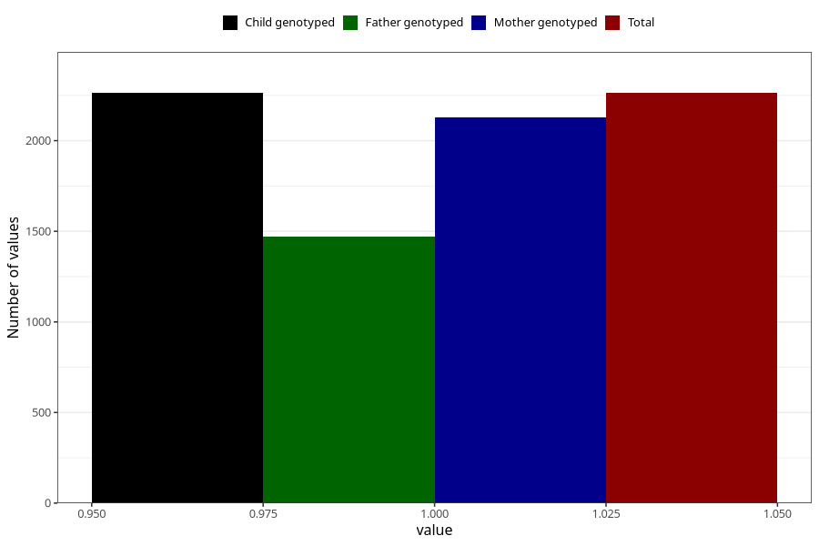

# pregnancy_itch_13w_16w
Variable mapping to `CC424` in `Skjema3_v12`.
- Number of values:

| Value | Total | Child genotyped | Mother genotyped | Father genotyped |
| ----- | ----- | --------------- | ---------------- | ---------------- |
| Missing | 78742 | 78742 | 74491 | 52131 |
| Non-missing | 2263 | 2263 | 2126 | 1473 |
| 1 | 2263 | 2263 | 2126 | 1473 |

