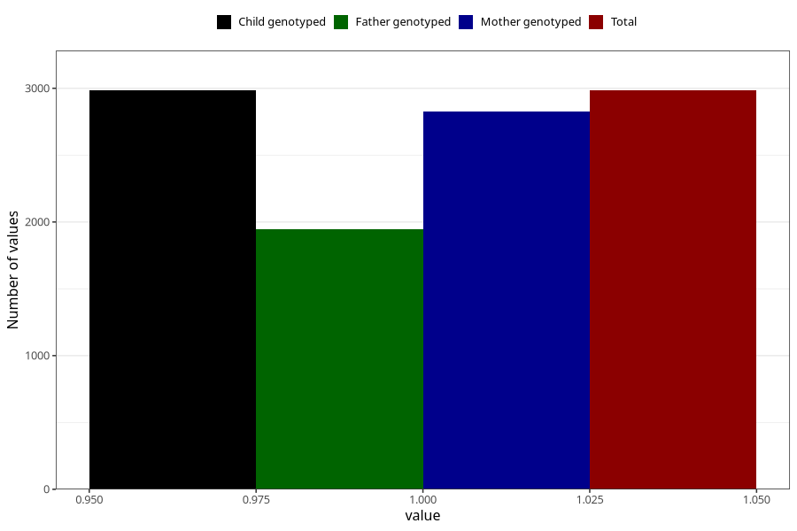

# pregnancy_itch_17w_20w
Variable mapping to `CC425` in `Skjema3_v12`.
- Number of values:

| Value | Total | Child genotyped | Mother genotyped | Father genotyped |
| ----- | ----- | --------------- | ---------------- | ---------------- |
| Missing | 78021 | 78021 | 73792 | 51660 |
| Non-missing | 2984 | 2984 | 2825 | 1944 |
| 1 | 2984 | 2984 | 2825 | 1944 |

