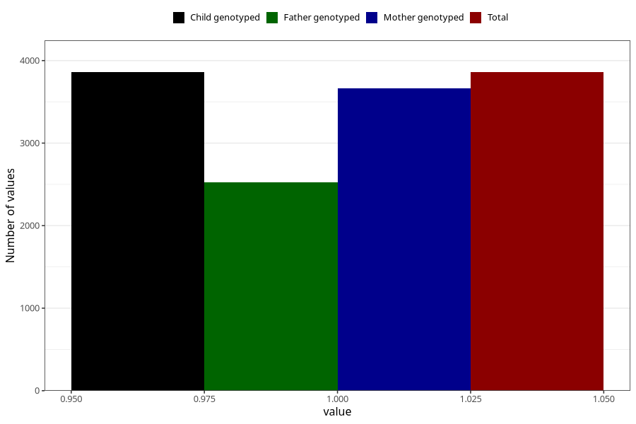

# pregnancy_itch_21w_24w
Variable mapping to `CC426` in `Skjema3_v12`.
- Number of values:

| Value | Total | Child genotyped | Mother genotyped | Father genotyped |
| ----- | ----- | --------------- | ---------------- | ---------------- |
| Missing | 77146 | 77146 | 72951 | 51077 |
| Non-missing | 3859 | 3859 | 3666 | 2527 |
| 1 | 3859 | 3859 | 3666 | 2527 |

