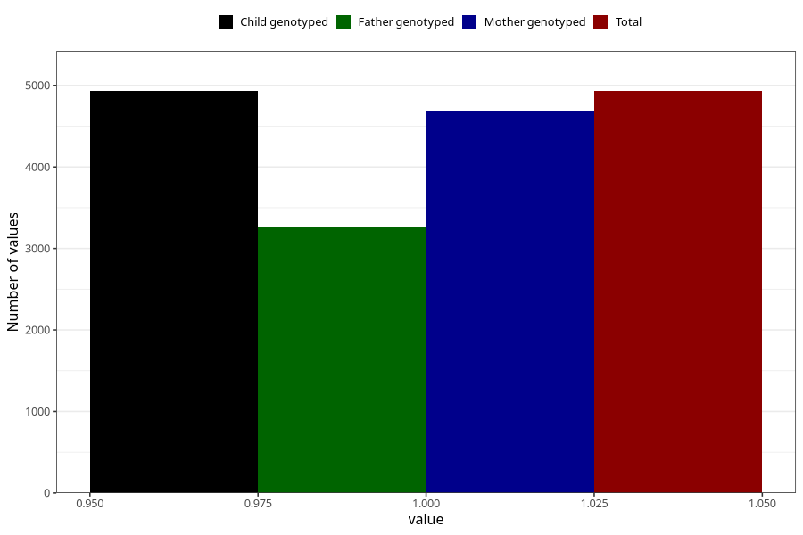

# pregnancy_itch_25w_28w
Variable mapping to `CC427` in `Skjema3_v12`.
- Number of values:

| Value | Total | Child genotyped | Mother genotyped | Father genotyped |
| ----- | ----- | --------------- | ---------------- | ---------------- |
| Missing | 76075 | 76075 | 71940 | 50347 |
| Non-missing | 4930 | 4930 | 4677 | 3257 |
| 1 | 4930 | 4930 | 4677 | 3257 |

