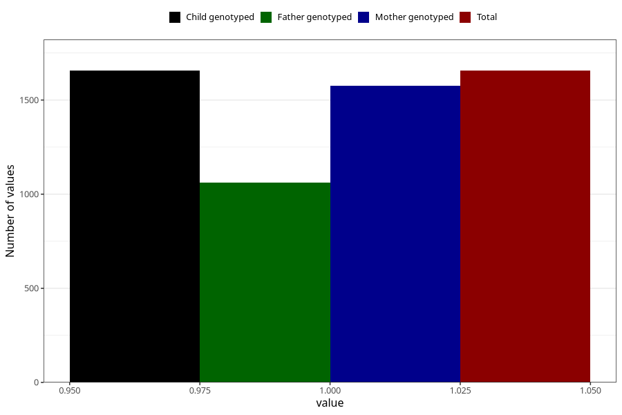

# pregnancy_itch_5w_8w
Variable mapping to `AA257` in `Skjema1_v12`.
- Number of values:

| Value | Total | Child genotyped | Mother genotyped | Father genotyped |
| ----- | ----- | --------------- | ---------------- | ---------------- |
| Missing | 79349 | 79349 | 75042 | 52544 |
| Non-missing | 1656 | 1656 | 1575 | 1060 |
| 1 | 1656 | 1656 | 1575 | 1060 |

