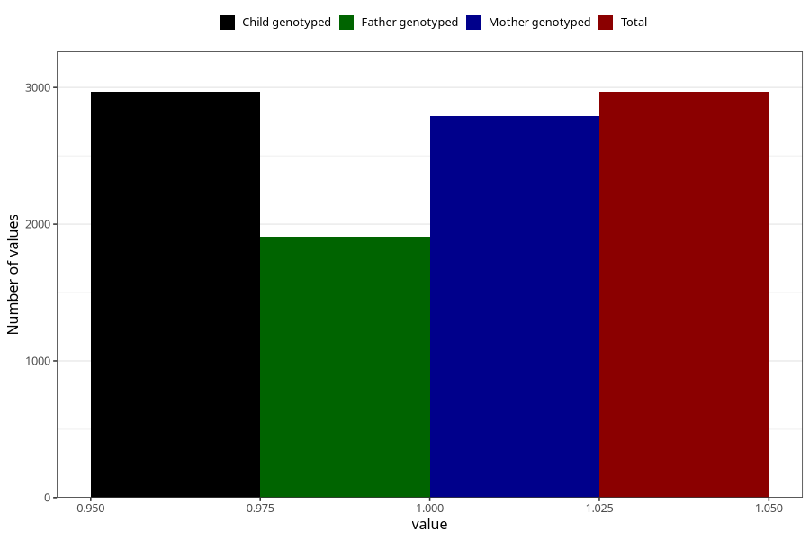

# pregnancy_itch_9w_12w
Variable mapping to `AA258` in `Skjema1_v12`.
- Number of values:

| Value | Total | Child genotyped | Mother genotyped | Father genotyped |
| ----- | ----- | --------------- | ---------------- | ---------------- |
| Missing | 78038 | 78038 | 73828 | 51693 |
| Non-missing | 2967 | 2967 | 2789 | 1911 |
| 1 | 2967 | 2967 | 2789 | 1911 |

